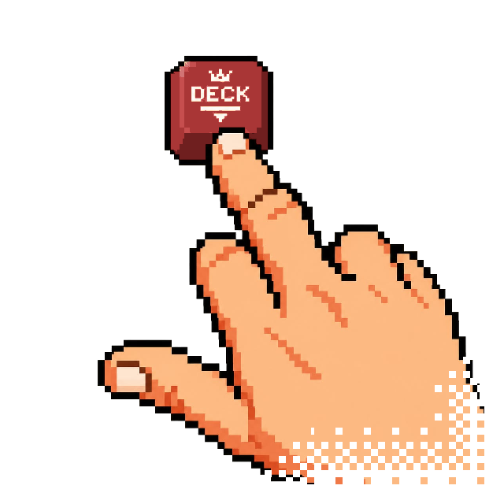

<p align="center">
  <picture>
    <source media="(prefers-color-scheme: dark)" srcset="assets/decktech-logo-dark.webp 1x, assets/decktech-logo-dark@2x.webp 2x">
    <source media="(prefers-color-scheme: light)" srcset="assets/decktech-logo-light.webp 1x, assets/decktech-logo-light@2x.webp 2x">
    
  </picture>
</p>

<h1 align="center">DeckTech</h1>

<p align="center"><strong>English</strong> | <a href="README.pt-BR.md">Português (Brasil)</a></p>

DeckTech turns a Mac or Windows PC into the host for a remote app dock. The application starts a local Node.js server and provides its interface to devices on the same network through the Android APK, an iPhone PWA, or a browser.

This public repository contains only documentation, community support, and official releases. DeckTech is proprietary software and its source code is not published.

Responsible party and licensor: Produtora MaxVision, CNPJ 38.386.434/0001-44, Diadema/SP.

## Downloads

| Platform | Direct download |
|---|---|
| Windows 11 (x64, build 22000 or later) | [`DeckTech-Setup.exe`](https://github.com/produtoramaxvision/DeckTech/releases/latest/download/DeckTech-Setup.exe) |
| Android 5.0+ | [`decktech.apk`](https://github.com/produtoramaxvision/DeckTech/releases/latest/download/decktech.apk) |
| macOS 14+ | [`DeckTech-macOS.dmg`](https://github.com/produtoramaxvision/DeckTech/releases/latest/download/DeckTech-macOS.dmg) |

You can also review the [latest release](https://github.com/produtoramaxvision/DeckTech/releases/latest) and [`SHA256SUMS.txt`](https://github.com/produtoramaxvision/DeckTech/releases/latest/download/SHA256SUMS.txt). Never install a Debug APK or files received through unofficial channels.

## Installation and first run

### Windows

1. Download and run `DeckTech-Setup.exe`.
2. The current installer is unsigned. If Microsoft Defender SmartScreen appears, confirm that the file came from this repository and that its SHA-256 matches; select **More info** and **Run anyway** only if you accept the risk.
3. On first launch, DeckTech shows the license agreement (EULA): tick the agreement checkbox to enable **Accept and start**, or choose **Decline and quit** to close the app. Declining is not remembered: the agreement is shown again on the next launch, and the app stays installed until you remove it in **Settings > Apps**. The button labels are in Portuguese (**Aceitar e começar** / **Recusar e sair**) when your system language is Portuguese.
4. DeckTech requires Windows 11 (build 22000 or later); the installer refuses earlier versions. The host UI on Windows is in Portuguese only in this release: its **Conectar** (Connect) tab shows the local address and the six-digit access code (PIN) — an address only shows up here if the computer is on a local network (Wi-Fi or Ethernet), not just a VPN.

### macOS

1. Download `DeckTech-macOS.dmg`, open it, and drag DeckTech to **Applications**.
2. The app is ad-hoc signed and not notarized. Control-click **DeckTech**, choose **Open**, and confirm. If Gatekeeper blocks it, try once and use **System Settings > Privacy & Security > Security > Open Anyway**.
3. On first launch, accept the license agreement (EULA) shown before the main window.
4. Open the **Connect** tab to see the local address and PIN. Unlike Windows, the macOS app has a language picker (Português/English) in that same tab, and its labels follow whichever language you choose there.

### Android

1. Download `decktech.apk` from this repository and allow installation from the browser when Android asks.
2. On first launch, accept the license agreement (EULA) shown in the app.
3. On a Windows or macOS host, open **Connect > Android app** (on Windows: **Conectar > App Android**) and scan the QR code with the phone camera. The APK then trusts only that computer's HTTPS certificate. The computer and phone must be on the same local network (LAN) or the same Tailscale; a pairing link pointing anywhere else is rejected for security (see [Troubleshooting in SUPPORT.md](SUPPORT.md#troubleshooting)).
4. When the app finds the computer through automatic discovery, it shows a 16-character security code (`XXXX-XXXX-XXXX-XXXX`). Confirm only if it matches, character for character, the **Security code** (on Windows: **Código de segurança**) on the host's **Connect** tab.
5. Enter the six-digit PIN. If the computer's certificate changes, the app asks you to confirm again. If you open the pairing link outside the app (through the camera, a browser, or another app), DeckTech asks for an extra confirmation before connecting (the one exception is a link identical to the connection the app already has saved) — only confirm if you are the one who just opened or scanned the link.

### iPhone, iPad, and browsers

1. On the host, open **Connect > Browser** (on Windows: **Conectar > Navegador**).
2. Scan or enter the local HTTP URL in Safari or another browser.
3. Enter the six-digit PIN. In Safari, use **Share > Add to Home Screen** to install the PWA.

The browser connection uses HTTP on the local network. Use the PWA only on a trusted LAN: the PIN controls access, but HTTP cannot prevent another network participant from observing or changing traffic. On Android, always prefer the pinned HTTPS flow in the **Android app** QR.

## OBS Studio

In v0.1.0, the **OBS Commander** drawer can switch scenes, start and stop recording and streaming, and pin scenes to the dock using the star beside each scene. Run OBS on the same computer that hosts DeckTech.

1. In OBS, open **Tools › WebSocket Server Settings**.
2. Tick **Enable WebSocket server** and use **Server Port: 4455**.
3. Keep **Enable Authentication** ticked and click **Show Connect Info**.
4. Copy the password, paste it into DeckTech's OBS drawer and tap **Save and connect**.

DeckTech also connects when OBS authentication is disabled, but we recommend leaving it enabled. The saved password stays only on the host computer in `.obs-password`; it is never returned to the phone in API responses or the WebSocket feed. If you enter it on the phone, it is sent to the host when saving; prefer Android with HTTPS for this setup. The file uses an owner-only ACL on Windows and `0600` permissions on macOS; DeckTech reapplies this protection at startup. ACL failures are logged, and an administrator can reclaim access to the file.

If connection fails, check that OBS is open and its WebSocket server is enabled. For a **wrong password**, copy the current password from OBS again and save it. If the port differs from **4455**, change it in OBS settings. No firewall rule is needed for the DeckTech–OBS connection: it stays local at `127.0.0.1` on the same computer (this does not change the network requirements between the phone and DeckTech).

## Verify checksums

Download the artifact and `SHA256SUMS.txt` to the same folder, then compare the file hash with its line:

```powershell
certutil -hashfile DeckTech-Setup.exe SHA256
```

```sh
shasum -a 256 DeckTech-macOS.dmg
sha256sum decktech.apk
```

[`DeckTech-macOS.dmg.sha256`](https://github.com/produtoramaxvision/DeckTech/releases/latest/download/DeckTech-macOS.dmg.sha256) also verifies the DMG specifically.

## Terms, privacy, and third-party components

- [End User License Agreement (EULA), Portuguese](EULA.md): the legally binding version; the English text is [EULA.en.md](EULA.en.md), a courtesy translation. The Windows first-launch screen shows both texts (English first unless your system language is Portuguese); if the two differ, the Portuguese text prevails.
- [Privacy Notice](PRIVACY.md)
- [Third-party notices](THIRD_PARTY_NOTICES.md)
- [License for this documentation](LICENSE)

The binaries are free of charge, proprietary, and licensed under the EULA. Third-party licenses continue to apply to their respective components.

## Support and security

- Reproducible bugs: [open an Issue](https://github.com/produtoramaxvision/DeckTech/issues/new?template=bug_report.yml)
- Ideas: [start a Discussion](https://github.com/produtoramaxvision/DeckTech/discussions/categories/ideas)
- Installation and questions: [SUPPORT.md](SUPPORT.md)
- Direct contact: [contato@decktech.com.br](mailto:contato@decktech.com.br)
- Vulnerabilities: [SECURITY.md](SECURITY.md); do not publish sensitive details in Issues

Participation is governed by the [Code of Conduct](CODE_OF_CONDUCT.md). The repository does not accept source-code pull requests; see [CONTRIBUTING.md](CONTRIBUTING.md).
